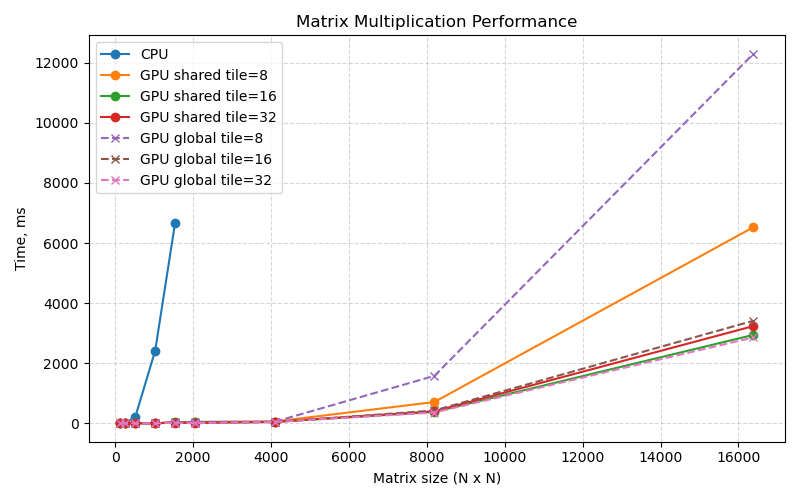

# Лаба 1

**Что сделано**
- Реализовано умножение матриц на CPU.
- Реализованы два варианта GPU: `GPU Global` (глобальная память) и `GPU Shared` (shared memory).
- Добавлены прогоны для нескольких размеров тайла (`8/16/32`) и запись результатов в CSV.
- Написаны unit‑тесты.

**Как распараллелено и почему**

Параллелизация идет по элементам результата `C`: каждый CUDA‑поток вычисляет ровно один элемент `C[row, col]`. Сетка блоков покрывает всю матрицу `C`, а размер блока задается как `tile x tile`.

**GPU Global**

Каждый поток выполняет цикл по `k` и читает `A[row, k]` и `B[k, col]` напрямую из глобальной памяти. Это просто, но дорого по памяти: одни и те же элементы `A/B` читаются много раз разными потоками.

**GPU Shared**

Каждый блок загружает кусок `A` и `B` размера `tile x tile` в shared‑память. Затем все потоки блока используют эти данные для вычисления своих элементов `C`. Это уменьшает число глобальных обращений и ускоряет вычисления.

## Сборка

Запускать из папки `lab1-matmul`

```bash
cmake -S .. -B ..\build -DCMAKE_BUILD_TYPE=Release
cmake --build ..\build --config Release
```

## Запуск

```bash
..\build\lab1-matmul\Release\lab1_matmul.exe
```

В `lab1-matmul/src/main.cpp` задаются список размеров матриц и список `tile` (`8/16/32`).

## Результаты и CSV

CSV сохраняется в `lab1-matmul/lab1_matmul_results.csv`.

Колонки:
```
size,tile,cpu_ms,
gpu_shared_kernel_ms,gpu_shared_total_ms,
gpu_global_kernel_ms,gpu_global_total_ms,
speedup_shared_kernel,speedup_global_kernel,
max_abs_error_shared,max_abs_error_global
```

## Результаты



как видно GPU global с tile = 32 и GPU shared с tile = 16 на больших матрицах себя показывают лучше всего

## Тесты

```bash
ctest --test-dir ..\build -R lab1_matmul_test -C Release --config Debug
```
