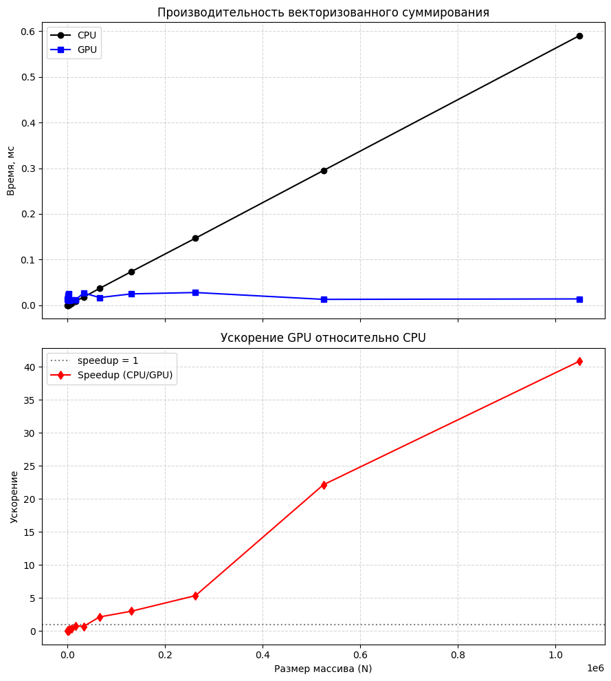

# Лаба 2

**Что сделано**
- Реализовано сложение элементов вектора на CPU.
- Реализовано сложение элементов вектора  GPU.


**Как распараллелено и почему**
Каждый блок сетки обрабатывает непрерывный фрагмент исходного массива. 
Внутри блока потоки работают параллельно. Количество потоков в блоке задаётся при запуске ядра (например, 256).
Каждый поток обрабатывает не один, а сразу несколько элементов (ITEMS_PER_THREAD), что увеличивает объём работы на поток и уменьшает общее количество блоков, необходимых для покрытия всего массива.

Как вычисляются индексы:
Пусть:

blockIdx.x – индекс блока,

blockDim.x – число потоков в блоке,

threadIdx.x – индекс потока в блоке,

ITEMS_PER_THREAD – сколько элементов обрабатывает один поток.

Тогда первый индекс для потока:
```
idx = blockIdx.x * blockDim.x * ITEMS_PER_THREAD + threadIdx.x
```
После того как поток вычислил свою частичную сумму, он сохраняет её в массив sdata, размещённый в shared memory. Shared memory доступна всем потокам блока и работает значительно быстрее глобальной.

Синхронизация __syncthreads() гарантирует, что все потоки записали свои значения, прежде чем начинается следующий этап.

На каждой итерации половина потоков суммирует два соседних элемента, уменьшая активную область вдвое.

Цикл выполняется, пока не останется одно значение в sdata[0] (сумма всех элементов, обработанных блоком).

Используется #pragma unroll, чтобы помочь компилятору развернуть цикл для небольших размеров блока, уменьшая накладные расходы.

## Сборка

Запускать из папки `lab2-vectorsum`

```bash
cmake -S .. -B ..\build -DCMAKE_BUILD_TYPE=Release
cmake --build ..\build --config Release
```

## Запуск

```bash
..\build\lab1-matmul\Release\lab2_vectorsum.exe
```

## Результаты и CSV

CSV сохраняется в `lab2-vectorsum\vectorsum.csv`.

Колонки:
```
size,
cpu_ms,
gpu_ms,
speedup,
check
```

## Результаты

Ускорение начинает проявляется для векторов размером >= 2^16 
## Тесты

```bash
ctest --test-dir ..\build -R lab2_vectorsum_test -C Release --config Debug
```
